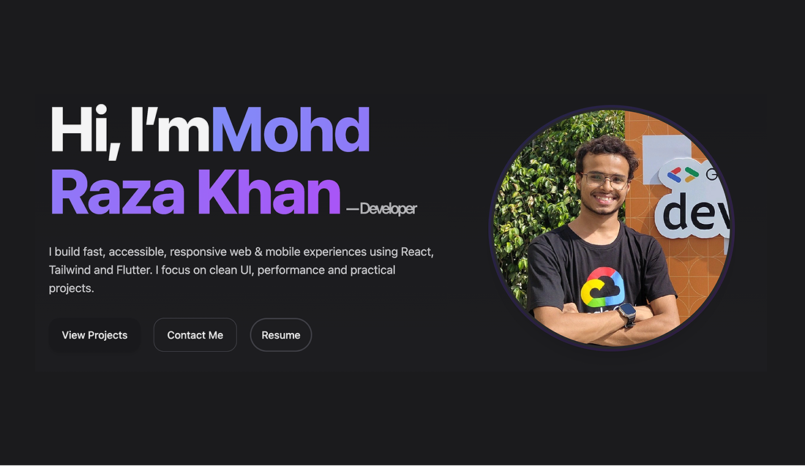

# Portfolio – Raza

A fast, modern, and responsive developer portfolio built with React, Vite, Tailwind CSS, and Framer Motion.

[](https://vitejs.dev/)
[](https://react.dev/)
[](https://tailwindcss.com/)
[](https://www.framer.com/motion/)

> Demo link (optional): https://github.com/mohdrazakhan/portfolio

---

## Features
- Responsive, accessible UI with Tailwind CSS
- Smooth animations using Framer Motion
- Dark/Light theme toggle
- Projects, Skills, About, and Contact sections
- Clean, component-driven structure

## Tech Stack
- React 19 + Vite 7
- Tailwind CSS 3
- Framer Motion 12
- Lucide Icons

## Quick Start

Prerequisites: Node.js 18+ and npm.

```bash
# 1) Clone the repository
git clone https://github.com/mohdrazakhan/portfolio.git
cd portfolio

# 2) Install dependencies
npm install

# 3) Start the dev server
npm run dev

# 4) Build for production
npm run build

# 5) Preview the production build (optional)
npm run preview
```

## Project Structure

```
├─ public/
│  ├─ favicon.ico
│  ├─ resume.pdf
│  └─ images/
├─ src/
│  ├─ assets/
│  │  ├─ icons/
│  │  └─ images/
│  ├─ components/
│  │  ├─ UI/
│  │  └─ ...section components
│  ├─ data/
│  │  ├─ config.js
│  │  ├─ projects.js
│  │  ├─ skills.js
│  │  └─ socials.js
│  ├─ hooks/
│  │  └─ useTheme.js
│  ├─ pages/
│  ├─ styles/
│  ├─ App.jsx
│  ├─ main.jsx
│  └─ index.css
├─ index.html
├─ package.json
├─ tailwind.config.js
├─ postcss.config.js
└─ vite.config.js
```

## Configuration
- Edit profile info, links, and content in:
  - `src/data/config.js`
  - `src/data/socials.js`
  - `src/data/skills.js`
  - `src/data/projects.js`
- Replace images in `src/assets/images/` and icons in `src/assets/icons/`.

Example project entry can be found in `src/data/projects.js`.

## Deployment

### GitHub Pages (static hosting)
Two easy options:

1) With GitHub Actions (recommended)
- Push to `main` on GitHub.
- In repo Settings → Pages, set Source: “Deploy from a branch” or use an Actions workflow for Vite.
- A typical Actions flow builds and publishes the `dist/` folder to `gh-pages`.

2) Manual publish to `gh-pages` branch
- Build locally, then publish the `dist/` directory to a `gh-pages` branch using your preferred tool.

Alternatively, deploy to Netlify or Vercel — both work great with Vite projects.

## Screenshots



## License
This project is licensed under the ISC license.

---

Made with ❤️ using React, Vite, Tailwind CSS, and Framer Motion.
